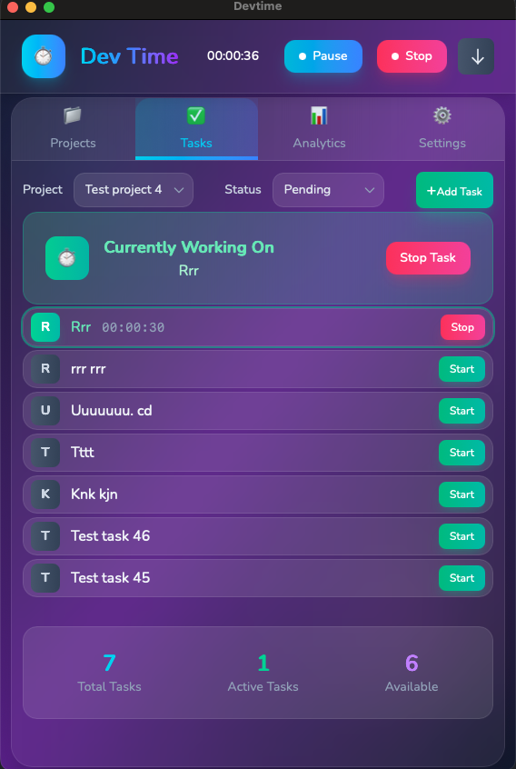

# DevTime - Developer Time Tracker

A comprehensive time tracking system with CLI, Desktop, Web, and Server components for tracking project time, managing tasks, and synchronizing data.



## Available Tools

### 1. CLI Tool (`devtime`)
Command-line interface for time tracking with local SQLite storage.

### 2. Desktop App
Cross-platform desktop application built with Wails (Go + React).

### 3. Web Frontend
React + TypeScript web application for project and task management.

### 4. Server
Go backend server with MongoDB for data synchronization and API services.

---

## CLI Tool Features

### Commands

| Command | Description | Usage |
|---------|-------------|-------|
| `start` | Start tracking time for a project/task | `devtime start` |
| `stop` | Stop tracking time | `devtime stop` |
| `report` | Show summary of time logs | `devtime report` |
| `syn` | Sync data between local and server | `devtime syn` |
| `login` | Authenticate with server | `devtime login` |
| `startWork` | Start the work timer | `devtime startWork` |
| `stopWork` | Stop the work timer | `devtime stopWork` |
| `monitor` | Start background idle monitor | `devtime monitor --threshold 10` |
| `stopMonitor` | Stop background monitor | `devtime stopMonitor` |

### Features
- Project and task time tracking
- Local SQLite database storage
- Server synchronization (Server → Local)
- Idle time monitoring
- Interactive prompts for project/task selection

---

## Desktop App Features

### Features
- **Time Tracking**: Start/stop work timers with pause/resume
- **Project Management**: Create and manage projects
- **Task Management**: Create and manage tasks
- **Analytics**: View time tracking analytics and reports
- **Picture-in-Picture**: Floating timer window (macOS)
- **Real-time Updates**: Live timer updates and status indicators

### Screens
- My Projects - Project management interface
- My Tasks - Task management interface
- Analytics - Time tracking analytics and reports

---

## Web Frontend Features

### Features
- **Dashboard**: Overview of projects, tasks, and time tracking
- **Project Management**: Create projects, add users with roles (ADMIN, MEMBER)
- **Task Management**: Create tasks, assign users with roles (OWNER, ASSIGNEE, REVIEWER, WATCHER)
- **Time Tracking**: Start/stop time tracking for projects and tasks
- **User Management**: Create and manage user accounts

---

## Server Features

### API Endpoints
- **Projects**: Create, list, add users to projects
- **Tasks**: Create, list, assign users to tasks
- **Users**: User creation and management
- **Time Tracking**: Start/stop timers, log tracking
- **Authentication**: JWT-based authentication

---

## How to Run

### Build CLI Tool
```bash
go build -o devtime
```

### Run Server
```bash
go run server/main-server.go
```
Server runs on `http://localhost:8080`

### Run Desktop App
```bash
cd desktop
wails dev
```

### Run Web Frontend
```bash
cd web
npm install
npm run dev
```
Web app runs on `http://localhost:3000`

**Note**: Ensure the server is running before starting the web frontend.

---

## Technology Stack

- **CLI**: Go, Cobra, SQLite
- **Desktop**: Wails v2, Go, React, TypeScript
- **Web**: React 18, TypeScript, Vite, Tailwind CSS
- **Server**: Go, MongoDB, JWT
- **Storage**: SQLite (local), MongoDB (server)

---

## Project Structure

```
devtime/
├── cmd/              # CLI commands
├── desktop/          # Desktop application
├── web/              # Web frontend
├── server/            # Backend server
├── localsrc/          # Local storage and utilities
└── main.go           # CLI entry point
```

---

## Quick Start

1. **Start Server**:
   ```bash
   go run server/main-server.go
   ```

2. **Run Desktop App** (in another terminal):
   ```bash
   cd desktop && wails dev
   ```

3. **Or Run Web Frontend** (in another terminal):
   ```bash
   cd web && npm install && npm run dev
   ```

4. **Or Use CLI**:
   ```bash
   go build -o devtime
   ./devtime start
   ```
