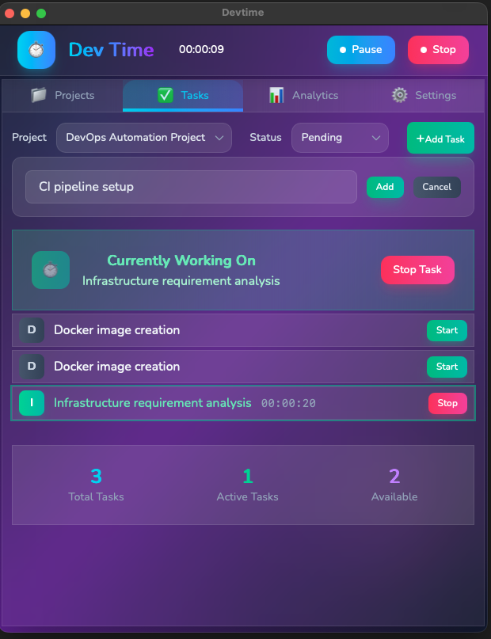
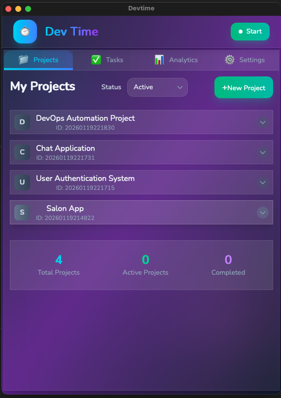
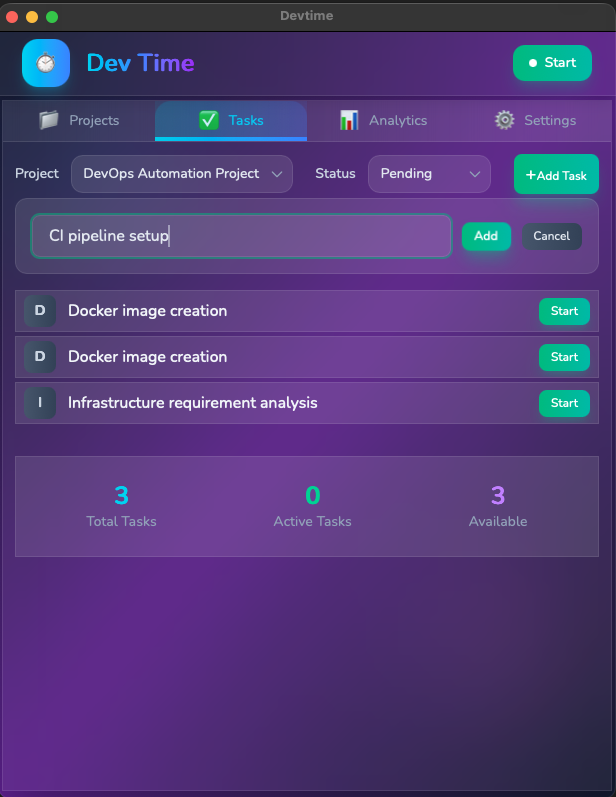

# DevTime - Developer Time Tracker

A cross-platform desktop application for tracking development time, managing projects and tasks, and viewing detailed analytics. Built with Wails (Go + React).



## Desktop App

Cross-platform desktop application built with Wails (Go + React) for tracking development time, managing projects and tasks, and viewing detailed analytics.

### Features

- **Time Tracking**: Start/stop work timers with pause/resume functionality
- **Project Management**: Create and manage projects with status tracking
- **Task Management**: Create and manage tasks linked to projects
- **Analytics Dashboard**: 
  - Visual timeline view of daily activities
  - Time-based task positioning (1 minute = 1 unit)
  - Project and task summary tables with duration and percentages
  - Filter by date with date picker
  - Idle time tracking (shown in different color)
- **Picture-in-Picture**: Floating timer window (macOS)
- **Real-time Updates**: Live timer updates and status indicators
- **Local Storage**: SQLite database stored in `~/.devtime/devtime.db`
- **Initial Setup**: First-run setup screen with progress indicator

### Screens

#### My Projects

Project management interface with create, update, and status management.




#### My Tasks

Task management interface with project association and time tracking.



#### Task and Timer

Real-time task tracking with integrated timer controls.


#### Analytics

- Interactive timeline showing tasks throughout the day
- Color-coded tasks (active vs idle)
- Summary tables for tasks and projects
- Date navigation with previous/next day controls

### Installation (macOS)

**Easy Installation - No Terminal Required:**

1. **Download** the appropriate DMG file from [Releases](https://github.com/yourusername/devtime/releases):
   - `DevTime-macos-intel.dmg` for Intel Macs
   - `DevTime-macos-apple-silicon.dmg` for Apple Silicon (M1/M2/M3) Macs

2. **Double-click** the DMG file to open it

3. **Double-click "Install DevTime.command"** inside the DMG

4. Follow the on-screen instructions - the installer will:
   - Copy DevTime to your Applications folder
   - Remove security restrictions automatically
   - Set proper permissions

5. **Open DevTime** from your Applications folder

**Alternative: Drag & Drop**
- Open the DMG and drag `DevTime.app` to your Applications folder
- Right-click DevTime in Applications → Open (first time only)

**Note**: The DMG installer handles all permissions automatically - no terminal commands needed!

### Development

To run the desktop app in development mode:

```bash
cd desktop
wails dev
```

To build for production:

```bash
cd desktop
wails build
```

The built app will be in `desktop/build/bin/`

### Technology Stack

- **Framework**: Wails v2
- **Backend**: Go
- **Frontend**: React 18, TypeScript, Vite, Tailwind CSS
- **Storage**: SQLite (local database in `~/.devtime/devtime.db`)

### Project Structure

```
devtime/
├── desktop/          # Desktop application
│   ├── frontend/     # React frontend
│   ├── build/        # Build artifacts
│   └── main.go       # Application entry point
└── localsrc/         # Local storage and utilities
```
